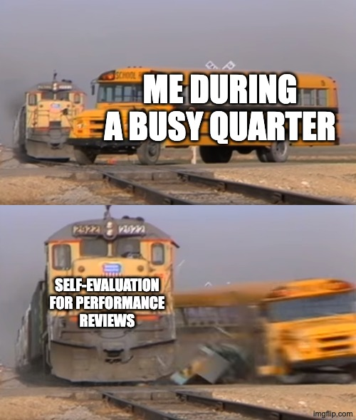

<div align="center">


# ✍🏻 self-eval

Writing self-evaluations is easy — but good self-evaluations are hard, especially when you're already busy enough. Sitting in front of a blank Google Docs, checking through your past projects, copy-pasting into Gemini and ChatGPT and hoping it makes you look good... sounds familiar?

Relieve your pain with a simple Claude skill that helps you scaffold either your accomplishment or a growth area, scoped into individual topics.

</div>

## ⚒️ Usage

### self-eval

| Command | Usage |
| -- | -- |
| `/self-eval` | Runs the full interview and drafts a paragraph |
| `/self-eval --accomplishment` | Skips the output-type question; goes straight to accomplishment mode |
| `/self-eval --growth` | Skips the output-type question; goes straight to growth area mode |
| `/self-eval --reset` | Clears your cached role and level so you can re-enter them |

### lemme-slack

A standalone sub-skill that scans your Slack history to surface evidence before writing. Also called automatically inside `/self-eval` at Step 2.5.

| Command | Usage |
| -- | -- |
| `/lemme-slack` | Guided search — you'll be asked for the project or topic |
| `/lemme-slack <project>` | Searches Slack for the named project directly |
| `/lemme-slack <project> colleague: @name` | Filters to messages from a specific colleague |
| `/lemme-slack <project> period: "Q1 2025"` | Restricts results to a date range |
| `/lemme-slack <project> channels: #chan1 #chan2` | Skips channel discovery; searches those channels only |

## 🚀 Installation

**One-time installation**

```bash
curl -fsSL https://raw.githubusercontent.com/andychanfp/self-eval/main/install.sh | bash
```

This installs both `/self-eval` and `/lemme-slack` into `~/.claude/skills/`. To update, rerun the same command.

## 🔎 How it works

1. **Identify yourself** — on first run, the skill asks for your job function and level. Cached for future runs.
2. **Pick the review period and output type** — MYR or EOY, accomplishment or growth area. Skipped if you passed a flag.
3. **Optionally pull Slack context** — the skill can scan your Slack history via `/lemme-slack` to surface stakeholder names, interaction examples, and concrete evidence before drafting. You choose whether to run it.
4. **Go through the interview** — the skill asks targeted questions to gather the specific moment, actions, and outcomes needed for an SBI paragraph (Situation → Behavior → Impact).
5. **Quality gate** — before showing you the result, the skill runs a silent self-check: grounded situation, behavior from evidence, traceable impact, no AI vocabulary or filler phrases.
6. **Approve, revise, or escalate** — accept the paragraph, ask for a rewrite, or trigger an adversarial sub-agent that reviews it against the Pandora career framework and design principles, then redrafts.

## ❓ FAQ

1. **Why not write self-evaluations manually?** You can. This just saves some time in the cold start.
2. **Will I get promoted with the AI self-evaluation?** This skill helps you write, not do your job. 
3. **What if I can't remember what I did?** Please try.
4. **Is it cheap to run this skill?** Takes about <3K tokens to complete one paragraph.